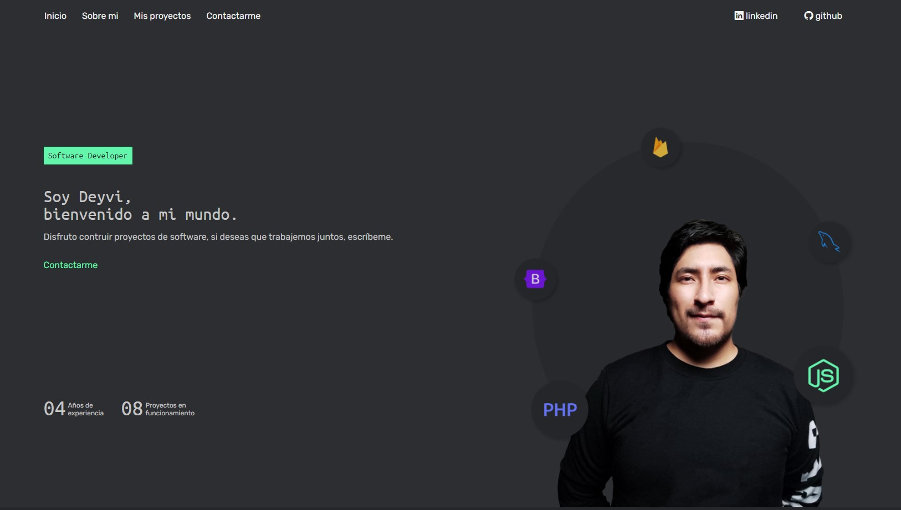

# Portafolio Personal

Hola soy Deyvi y este es mi portafolio personal, donde quise plasmar todo lo aprendido sobre el mundo `front-end` y el diseño de interfaces `UI`, puesto que soy principalmente `back-end` y ahora estoy ampliando mis conocimientos para ser un profesional más completo.

Espero disfrutes de cada detalle que le puse con mucho cariño.

## Tecnologias

- HTML
- SCSS
- JavaScript

## Links
- sitio web: https://deyvicode.github.io
- mi linkedin: https://www.linkedin.com/in/deyvidelacruz/

## Licencia
Este proyecto es de codigo abierto, esta bajo la licencia GPL v3.0. Por favor revise los términos y condiciones de usar este proyecto en el archivo [LICENSE](./LICENCE).